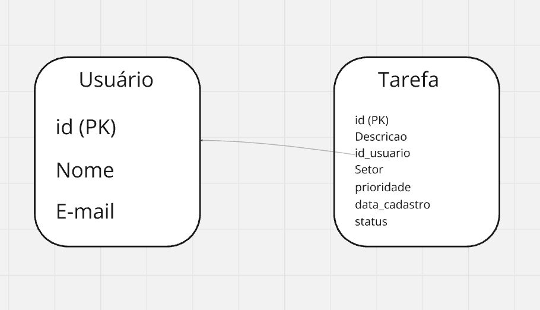
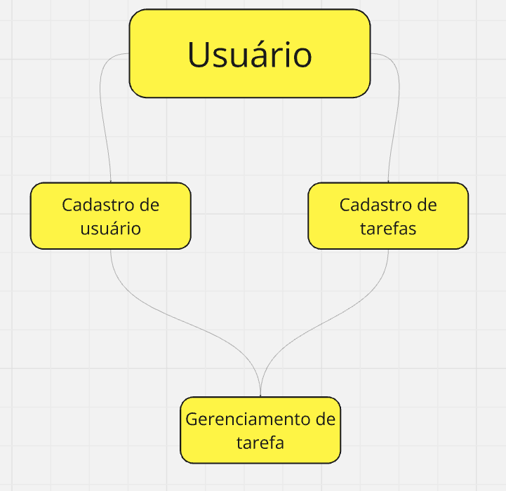

CREATE TABLE usuarios (
    id SERIAL PRIMARY KEY,
    nome VARCHAR(100) NOT NULL,
    email VARCHAR(100) NOT NULL UNIQUE
);

CREATE TABLE tarefas (
    id SERIAL PRIMARY KEY,
    descricao TEXT NOT NULL,
    setor VARCHAR(50) NOT NULL,
    prioridade VARCHAR(10) CHECK (prioridade IN ('baixa', 'média', 'alta')) NOT NULL,
    data_cadastro TIMESTAMP DEFAULT CURRENT_TIMESTAMP,
    status VARCHAR(10) CHECK (status IN ('a fazer', 'fazendo', 'pronto')) DEFAULT 'a fazer',
    usuario_id INT REFERENCES usuarios(id) ON DELETE CASCADE
);
ALTER TABLE tarefas ALTER COLUMN descricao TYPE VARCHAR(50);
ALTER TABLE tarefas ALTER COLUMN setor TYPE VARCHAR(50);
ALTER TABLE tarefas ALTER COLUMN prioridade TYPE VARCHAR(20);  -- ou outro valor adequado
ALTER TABLE tarefas ALTER COLUMN status TYPE VARCHAR(20);      -- ou outro valor adequado

  

